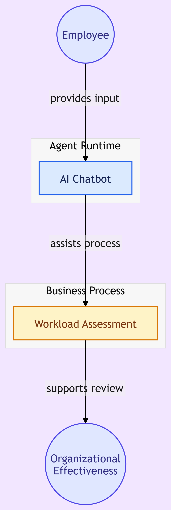

# AgenteIA_LevantamientodeCargasLaborales
Agente de Inteligencia Artificial tipo ChatBot para asistir al proceso de Levantamiento de Cargas Laborales de la Gerencia de Efectividad Organizacional para el Banco de Bogotá.

